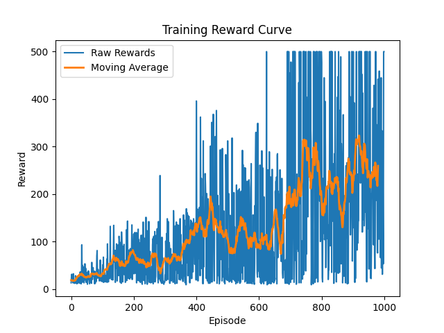

# Deep Q Learning (DQN) and Double DQN for CartPole

## Overview

This project implements a Deep Q-Network (DQN) and its improved variant Double DQN using PyTorch to solve the CartPole-v1 environment from Gymnasium.

The goal is to train an agent that learns to balance a pole on a cart by maximizing cumulative reward through reinforcement learning.

---

## Key Concepts

### Deep Q-Network (DQN)

* Uses a neural network to approximate Q-values
* Learns optimal actions through interaction with the environment
* Suffers from instability and overestimation bias

### Experience Replay

* Stores past experiences `(state, action, reward, next_state)`
* Breaks correlation in training data
* Improves learning stability

### Target Network

* A separate network used to compute stable Q-targets
* Updated periodically to reduce oscillations in training

### Double DQN

* Separates action selection and evaluation
* Reduces overestimation bias in Q-values
* Leads to more stable and consistent learning

---

## Environment Details

### State Space

* Cart Position
* Cart Velocity
* Pole Angle
* Pole Angular Velocity

### Action Space

* 0 → Move Left
* 1 → Move Right

---

## Results

The agent learns to balance the pole effectively over time.

* Initial performance: ~10–20 reward
* Final performance: 200–500 reward
* Achieves near-optimal behavior (500 reward)

### Training Curve



---

## Observations

* Basic DQN showed unstable learning and inconsistent rewards
* Adding a target network significantly improved stability
* Double DQN reduced overestimation and improved consistency
* Final model achieves stable high rewards with smoother convergence

---

## Tech Stack

* Python
* PyTorch
* Gymnasium
* NumPy
* Matplotlib

---

## How to Run

```bash
pip install -r requirements.txt
python train.py
python evaluate.py
```

> If you want to see the CartPole window during evaluation, install the classic control extras:
> `pip install "gymnasium[classic-control]"`
> or make sure `pygame` is available in your environment.

---

## Key Learnings

* Reinforcement learning is highly unstable without proper techniques
* Target networks help stabilize training
* Double DQN improves accuracy by reducing overestimation bias
* Proper experimentation and visualization are crucial in ML projects

---

## Future Work

* Dueling DQN
* Prioritized Experience Replay
* PPO (Policy Gradient Methods)
* Apply to more complex environments (Atari, LunarLander)

---

## Author

Tanush Kumar
